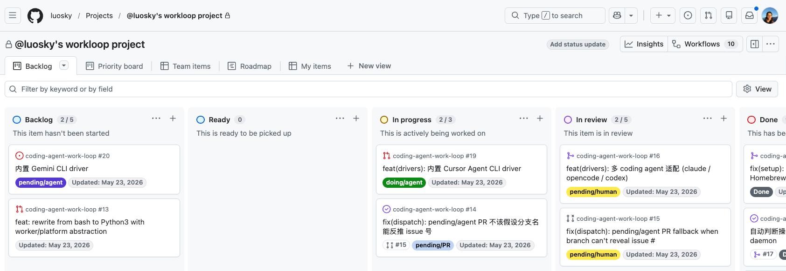

# coding-agent-work-loop

> **English** · [中文](README.zh.md)

> Send AI a batch of issues, async-review the PRs it ships — like working with a real teammate.
>
> Turn "babysitting AI step-by-step" into "sleep on it, review the PRs in the morning."

## What it is



A GitHub-label-driven workflow for **AI coding agents** (Claude Code / OpenCode / Codex / your own). Installed as an [Agent Skill](https://agentskills.io/home) on your machine — runs a 60-second background poller that watches your repos for label triggers, dispatches a local AI worker in an isolated git worktree to do design / coding / review work, and posts everything back as GitHub comments + PR commits.

Three things you should know up front:

- **Local, not cloud**: the AI worker is your local `claude` (or any other supported coding CLI) — your code never leaves your machine
- **GitHub is the interface**: labels (`pending/agent` / `pending/human` / `doing/agent`) drive everything; no web UI to learn
- **You stay in control**: every change goes through a PR review you sign off on; the tool never auto-merges

## Why use it

Working with AI on code is normally **serial**: prompt → wait → read → respond → wait → read… You can't walk away, the AI's history is locked in some chat UI.

This tool fixes three things at once:

### 1. Sync → async parallel

You stop being "the person chatting with the AI" and become "the person reviewing the AI's PRs."

```
Before bed: open 10 issues, label each pending/agent, close laptop, sleep.
Morning:    10 PRs / design proposals sit on GitHub. Review them like a reviewer—
            merge what's good, comment + re-label what needs changes,
            AI does another round on its own (you stay hands-off).
```

Multiple requests run **truly in parallel** — each issue gets its own worker / worktree / git branch, no cross-blocking. Progress is visible at a glance via GitHub labels. The [official GitHub mobile app](https://github.com/mobile) handles review + comment + label, so you can keep things moving during the commute.

### 2. All process + artifacts traceable by issue number

Every artifact from an issue's run is filed under its **issue number**:

| Artifact | Where |
|---|---|
| Design proposal + discussion | issue comments |
| Code | dedicated worktree + `feature/issue-<N>` branch |
| AI's full conversation (incl. thinking + tool calls) | `~/.claude/projects/<encoded-cwd>/<uuid>.jsonl` |
| tmux pane history | `$STATE_DIR/sessions/<project>-issue<N>.log` |
| Review report | PR comment |

Six months later debugging some hairy code, wondering *why* it was written that way? Two levels of lookup, from light to heavy:

1. **GitHub issue/PR comments first** — design proposal, the discussion thread, review report all live here. `gh issue view 42 --comments` or browser, 5 seconds. 95% of "why is this code shaped this way" answers come from this level
2. **Resume the AI session if you need to dig deeper** — `cd <worktree>/issue-42 && claude --resume` drops you back into the AI's full conversation: every alternative considered, every dead-end explored, the reasoning chain not fully written out in the final PR comment

Either way: **not** scrubbing through nameless AI chat sessions or reconstructing intent from a one-line commit message.

#### Compounding effect: the longer you use this, the smarter your agent gets

This is the part that compounds over time — **decision history is readable by both humans and AI agents**.

When a *new* issue touches code that was last changed in issue #42, the AI worker runs `gh issue view 42 --comments` itself, pulls the full prior context (design rationale, alternatives weighed, trade-offs accepted), and proceeds informed. **No one has to spoon-feed it "here's the background, X was tried, Y didn't work because…" every single time.**

The more issues your project accumulates this way, the richer the searchable context becomes. AI agents working on month-6 issues land with an understanding of decisions made in month-1 — automatic onboarding without anyone writing onboarding docs.

Useful for:
- **Humans** debugging old code, onboarding teammates, post-mortem on regressions — read the issue thread first, resume session if needed
- **AI agents** picking up related work — they self-serve context via `gh issue view <N> --comments`, no human-in-the-loop briefing needed

Full retention policy + lookup / resume SOPs: [docs/persistence.md](docs/persistence.md).

### 3. Cheap (Pro/Max subscription, not API tokens)

| | Webhook + Anthropic API | This tool |
|---|---|---|
| Per-trigger model cost | Burns API tokens (every call $$) | `claude` CLI under your Pro/Max subscription — **no tokens** |
| Idle cost | Webhook infra + standby fees | **$0** (60s polling only hits GitHub API, not the model) |
| Long-running cost (6 months, dozens of issues/wk) | hundreds–thousands USD | flat \$20–\$200/month Pro/Max |

Especially good fit for 24/7 "AI auto-reviews + auto-fixes" patterns where webhook+API costs balloon.

## How it works

A **background poller** on your machine looks at GitHub every 60 seconds. When it sees an issue or PR labeled `pending/agent`, it spins up Claude Code locally in an **isolated working directory** to do the work — read comments, write code, run tests, commit, push, reply — then flips the label back to `pending/human` for your review. Everything stays as a paper trail in GitHub comments.

Two trigger scenarios:

| Scenario        | Trigger                                      | What the AI does                                                                                                                                     |
| -----------------| ----------------------------------------------| ------------------------------------------------------------------------------------------------------------------------------------------------------|
| New request     | Add `pending/agent` to an issue              | Posts a **design proposal** comment first (asking how to approach it, whether to split PRs), then on your confirmation: branch → implement → open PR |
| Review feedback | Add `pending/agent` to a PR (with a comment) | Finds the AI session for this PR, reads the latest comment, and acts                                                                                 |

## What it **doesn't** do

- ❌ **Not a cloud service**: runs on your laptop / NAS. Machine off = it stops
- ❌ **Doesn't replace code review**: the AI changes code and auto-pushes, review is still your job. Protect main + require reviewers
- ❌ **Doesn't auto-merge**: merging / closing PRs is always your call

---

## Quick start

### 1. Install (once)

```bash
npx skills add luosky/coding-agent-work-loop -g
```

<details>
<summary>Manual install (without npx)</summary>

```bash
git clone https://github.com/luosky/coding-agent-work-loop.git ~/github/coding-agent-work-loop
mkdir -p ~/.agents/skills ~/.claude/skills
ln -s ~/github/coding-agent-work-loop ~/.agents/skills/coding-agent-work-loop
ln -s ~/.agents/skills/coding-agent-work-loop ~/.claude/skills/coding-agent-work-loop
```

Code lives in `~/github/`; two symlinks let Claude Code find it. Future upgrade: `cd ~/github/coding-agent-work-loop && git pull`.
</details>

### 2. Connect a project

```bash
bash ~/.agents/skills/coding-agent-work-loop/setup.sh ~/path/to/your-project
```

Or just say "install coding-agent-work-loop on ~/path/to/your-project" inside Claude Code — the AI will run it.

One command handles: per-project config, registering the background poller, creating `pending/agent` / `pending/human` etc. labels in the repo, starting the timer. Non-destructive, idempotent.

### 3. Keep running while logged out (optional)

```bash
sudo loginctl enable-linger $USER
```

Linux stops user services on logout by default; this keeps the poller alive when you're away.

## Dependencies

`git`, `gh` (run `gh auth login` first), `tmux`, `jq`, `flock`, `claude` (Pro/Max plan). `setup.sh` auto-detects the OS: Linux uses the built-in `systemd` user timer; macOS uses a `launchd` LaunchAgent (see [docs/operations.md → Scheduler by OS](docs/operations.md#scheduler-by-os)). Tested on Ubuntu 22.04 / 24.04; macOS supported, community testing welcome.

---

## Usage

### Scenario 1: New request

```bash
gh issue create --title "..." --body "..."     # say you get #42
gh issue edit 42 --add-label pending/agent
```

Within 60s the poller picks it up: builds an isolated working dir, starts Claude Code, writes code, opens a PR (with `Closes #42` or `Refs #42` in the body), flips the label to `pending/human` for your review. Watch what the AI does: `tmux attach -t <project>-issue42`.

### Scenario 2: PR review feedback

```bash
gh pr comment N --body "rename foo to bar"
gh pr edit N --add-label pending/agent --remove-label pending/human
```

Within 60s the poller finds the AI session for this PR, feeds in your comment → AI edits → tests → push → reply → flip label.

### Scenario 3: Clarification question

```bash
gh pr comment N --body "why not pattern X here?"
gh pr edit N --add-label pending/agent --remove-label pending/human
```

AI sees it's a discussion question, replies without touching code, keeps label `pending/human` waiting for your next turn.

---

## Read more

| Doc | About |
|-----|-------|
| [docs/architecture.md](docs/architecture.md) | Five-state label machine, PR↔Issue closure relationship (A/B/C), why the design works this way |
| [docs/collaboration.md](docs/collaboration.md) | Multi-human + multi-agent workflows: PM → Dev → QA handoff via label suffixes (`pending/agent/PM`, `pending/human/Alex`, …) |
| [docs/persistence.md](docs/persistence.md) | Where design proposals / discussions / code / Claude conversations / tmux history live, how to look them up later, how to resume from a break point |
| [docs/security.md](docs/security.md) | **Public-repo users must read.** Anonymous comments can contain prompt injection; how the defenses work |
| [docs/operations.md](docs/operations.md) | Full config, prompt templates, multi-project, upgrades, macOS launchd, webhook trigger, swapping AI worker, troubleshooting |
| [docs/drivers.md](docs/drivers.md) | Worker agent drivers — built-in `claude` / `opencode` / `codex` / `cursor`, plus how to add your own |

## Note

This is an **Agent Skill** — a feature package loaded by AI coding tools like Claude Code. But you don't need Claude Code to run it: the background scripts are plain shell + `gh` CLI, scheduled by cron / systemd / launchd. Worker CLI is selected via `WORKER_AGENT=<name>`; built-in `claude` / `opencode` / `codex` / `cursor` drivers ship; add your own — see [docs/drivers.md](docs/drivers.md).

## License

MIT. See [LICENSE](LICENSE).
