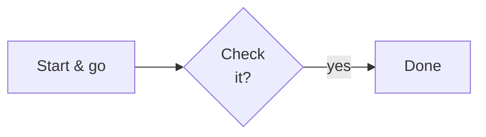

Before the diagram & after.


```mermaid
flowchart LR
  A["Start & go"] --> B{Check<br/>it?}
  B -- yes --> C[Done]
```

```geojson
{"type": "Point", "coordinates": [1, 2]}
```

```js
const x = 1 < 2;
```
